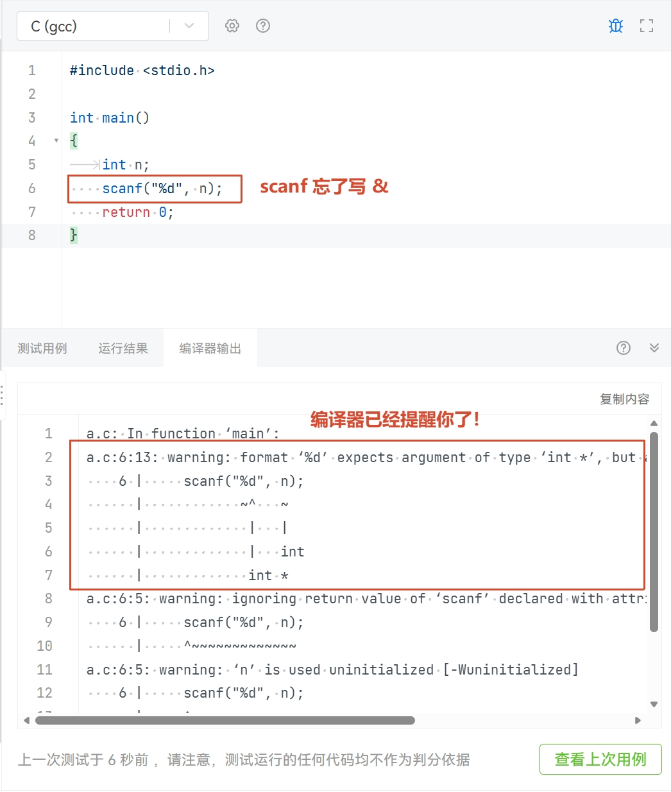

# 调试技术


!!! info
    本文档来自 ZhouTimeMachine 在 2023 年为程算课程准备的[资料](https://zhoutimemachine.github.io/2023_FPA/) 。在此郑重感谢。

!!! note
    有些相关知识课上还未学到，零基础的同学们可以回头再看这里的内容。

在本章节，我们将学习如何找出我们所写的代码中的错误 (bug)，即 debug。

首先介绍什么是 bug：一般来说，只要“程序没有表现出我们期望的行为”都可以算出现了 bug。如果要进一步分类的话，我们用输出日志的几种类型对 bug 进行介绍：

- `info`: 正常的提示性**信息**，出现这种信息说明程序运行一切正常
- `warning`: **警告**，过程中出现异常表现但不一定出现异常结果，可能仍能完成预期任务
- `error`: **错误**，出现了异常的结果，不能完成程序预期的任务
- `fatal`: **致命**错误，不仅不能完成预期任务，而且程序无法正常运行（例如直接死亡）

当然实际使用中 warning、error 和 fatal error 的界限可能比较模糊，但是以下两点宗旨是确定的：

- error 一定要解决
- warning 越少越好（最好没有），了解所有你允许的 warning 产生的原因

!!! Note
    最重要的一点：一定要学会阅读编译器输出的信息！
    很多时候，编译器就已经帮你把错误指出来了！

<div align="center" markdown="1">



</div>


## 静态调试

如果经验丰富或者耐心仔细，那么其实你不跑程序就可以看出代码中的错误并进行修改。尤其是开发者自己参与度高的复杂项目，自己推演思考可能的错误可能是一种不错的静态 debug 手段。

### 积累常见 bug 经验

一方面，了解开发人员群体容易产生的共性 bug，这样自己遇到相同的错误也能有个印象及时索引；另一方面，要多多进行 debug 实践，在实践中总结自己经常出的 bug，必要时可以做笔记。

除了在[开发环境安装与第一次编译运行](../env/index.md)的“常见问题”中提过的代码错误外，这里再放几个 bug 的例子。

#### 经典共性 bug

- 检查变量类型是否正确，是否重名，是否存在非预期的强制转换
    - 很多时候会以编译器报 warning 的形式出现，务必搞清楚 warning 的产生原因
- `scanf` 输入时是否正确添加了 &，格式字符串是否正确
- `printf` 输出格式是否正确，是否误加了 &
- 循环变量 i, j 是否写混了、重了，是否用错了层数
    - 熟练之后，循环变量可以使用具有实际含义的命名，也可以一定程度上避免这个问题
- 数组是否开的足够大，是否存在数组越界问题
    - 虽然动不动就开个巨大的数组可以解决问题，但还是推荐平时练习时能够精准控制自己实际用到的数组空间

#### 比较运算符乱用

下面的程序段，看起来应该没有数会比 3 大还同时比 1 小，怎么反正输出 `True!` 了呢？一般是初学者和很久没写 C 有些生疏的同学会犯这个错误，这里 `3 < x < 1` 按照左结合计算，首先计算 `3 < x` 得到结果为 0，然后计算 `0 < 1` 结果为 1，因此条件满足，打印 `True!`。

```C
int x = 2;
if (3 < x < 1) {
    printf("True!"); // True!
}
```

下面这个错误更容易犯一些，有些比较熟悉的同学 debug 的时候偶尔也无法一眼看出来。其实就是比较运算符 `==` 打成了赋值运算符 `=`，导致实际上将 x 赋值为 1，整体运算结果也是 1，从而继续执行条件语句内的 `printf`。
```C
int x = 2
if (x = 1) {
    printf("True!"); // True!
}
```

#### 初始化和置零

在下面的代码中，定义了 a, b 两个 `int` 类型变量。b 进行了初始化，其值是确定的 1；a **尚未初始化**，在它被赋值之前它的值都是不确定的，如果直接拿来用将可能出现错误。

```C
int a, b = 1; // ?, 1
```
> 本地跑的时候都对，但是 PTA 一测试就错误，可能你的编译器总会默认把 a 初始化为 0，但 PTA 不会惯着你的程序，会想办法给你初始化一个奇怪的值。

在下面的代码中，定义了 `int*` 类型的 c，但是 d 仍然只是 `int` 类型。如果想要让 d 也是 `int*`，那么需要写作 `int *c, *d;`。

注意此时的 d 也是没有初始化的，可能出现和上面的 a 一样的问题。c 同样也没有被初始化，如果直接进行解引用问题就更大了，这样的没有被初始化的指针我们称之为**野指针** (wild pointer)，是著名的 bug 产生原因。

```C
int *c, d; // int* and int
// c is a wild pointer!
```

与野指针并称的是**悬垂指针** (dangling pointer)，也就是指针所指的空间被 `free` 释放了，之后又被拿来访问所指空间的情况。

> 悬垂指针重访问，有时本地跑也经常看不出问题，因为你可能 free 之后对它的访问只是读取，而你访问足够快以至于那块空间还没有被回收或复写，从而看起来程序执行结果依然正常

```C
c = (int *)malloc(sizeof(int));
free(c) // c is a dangling pointer!
```

一种比较无脑的解决方法就是指针初始化为 0、空间释放后重新置零，但如果你很清楚你在写什么，你可以随意灵活调度你所创建的变量，野指针、悬垂指针都无所谓。

#### 没有进循环？

以下程序的输出只有一个 10，而不是预期那般输出 0-9 的数字，试解释其中原因。答案用折叠框隐藏了，大家可以尝试静态思考一下。

```C
int i;
for (i = 0; i < 10; ++i);
{
    printf("%d\n", i);  // 10
}
```

??? general "原因解释"
    注意到第二行末尾有一个 `;`，相当于 `for (i = 0; i < 10; ++i);` 进行了 10 轮空循环，随后 i 值为 10。这样大括号语句就不从属于 for 循环，只在随后执行了一次，打印 i 的最新值。

### 颅内运行

即化身人脑计算机，在人脑编译运行的过程中发现问题。（<del>动态调试</del>）

- 面对小型程序最好的办法，个人经验是 50 行以内
- 类似作业和考试中阅读代码填写输出的题目，是需要掌握的技能
- 设计各种可能的测试样例，按照计算机的逻辑思考它会怎样运行
- 在颅内/纸笔运行的过程中你大概率就会发现问题的所在

> 先想象自己变成了计算机先生，然后再去运行代码会更好。
>
> + 大喊“我是计算机”；
> + 想象自己被给予了算法与输入
> + 然后，按照流程笨拙、踏实地一步一步运行
>
> 不得不说这很麻烦，但据说这样是理解算法最快的方法。
> —— 结城浩

### 培养优雅的码风

优雅的代码风格会让你的代码看起来更加清爽，你想要回过头看代码的时候会更有进行检查的耐心。经常出现

- 想找他人请教，但是他人觉得你的码风太乱读不下去
- 两个人互相嫌弃对方码风不优雅
- 自己码风太乱导致自己都 debug 不下去
- 回看多年前的代码根本不知道自己为什么这么写
- ……

至于怎么样的码风才是优雅，向来众说纷纭，例如大括号换行派和不换行派，以及小驼峰大驼峰匈牙利等命名规范，各自都有其追随者。不过有一些几乎形成了共识：

- 不要混用命名规范，比如变量命名一会儿驼峰一会儿匈牙利
- 不要使用拼音命名，比如想要命名一个车变量，可以叫 car，不要叫 che
- 不要极限压行，能写清楚的写清楚一些
- 在必要的地方加注释

### 求助他人

将这种手段作为最后手段，**尽量自己 debug**。初学时比较简单的程序还好，未来复杂的程序有能力和愿意帮忙的人会越来越少。真的要找他人帮忙时，尽量提供[最小可重现示例](https://en.wikipedia.org/wiki/Minimal_reproducible_example) (minimal reproducible_example)

求助他人时，请注意礼貌与[提问的智慧](https://github.com/ryanhanwu/How-To-Ask-Questions-The-Smart-Way/blob/main/README-zh_CN.md)。遇到难以解决的问题，优先**积极搜索**，bing、google、stackoverflow 经常可以找到答案。或许初学时百度百科、百度知道、CSDN 能够给你一些似乎还行的指引，但是随着你逐渐熟练，你会发现他们带给你的坑将远比帮助更多。

## 动态调试

### printf 大法
> printf 大法不专指 `printf`，在 C 中也可以是 `puts` 等输出函数，又或许是 C++ 的 `cout`、Python 的 `print`、Java 的 `System.out.println`，甚至是打日志

printf 大法的强大之处在于它可以在程序的各种位置灵活输出你所关心的变量值，开发人员通过 printf 侧面剖析程序的运行情况，从而确定问题症结。在业界应用中，printf 大法甚至可以让上线的代码继续维持运行，只是在关键节点打印信息以检查错误，减少服务下线带来的损失。

在这里介绍一下我本人应用 printf 的框架：

- 定位问题发生的区域
- 定位异常变量
- 定位问题发生的代码

例如程序陷入了死循环，那么可以

- 定位问题发生的区域：各个循环前后设置 printf，根据输出初步判断在哪个循环发生了死循环
- 定位异常变量：关注这个死循环，打印你所关心的几个变量，看看哪个变量和预期结果不符
- 定位问题发生的代码：静态思考，或者在循环内部代码级设置 printf，定位哪一句发生了问题
- 如果一句代码中做了很多事，那么可以拆分这句代码进行更细粒度的分析

因此建议**不要压行**，一句代码不必做太多事情，否则不仅阅读有困难，调试也会比较麻烦。

### VSCode 配置调试

可以参考 [GZTime 的教程](https://blog.gztime.cc/posts/2020/6b9b4626/#%E9%85%8D%E7%BD%AE%E6%AD%A5%E9%AA%A4)，从 1.3.3 开始跟着配置。注意一下按照这个教程需要按照其要求的文件组织形式工作，并且不管 C/C++ 程序都会使用 g++ 编译。比较熟练的同学可以通过自行修改 `tasks.json` 和 `launch.json` 进行自己的配置。

!!! info "希望快速上手的同学可以按接下来的引导配置，面向单文件编译，编译产生的可执行程序与源代码在同一目录下"

在工作目录的 `.vscode` 文件夹下创建 `tasks.json` 和 `launch.json` 文件。如果还没有 `.vscode` 文件夹，则手动创建一个。`tasks.json` 的内容为
```json
{
    // See https://go.microsoft.com/fwlink/?LinkId=733558
    // for the documentation about the tasks.json format
    "version": "2.0.0",
    "tasks": [
        {
            "label": "C build",
            "type": "shell",
            "command": "gcc",
            "args": [
                "${file}",
                "-o",
                "${fileDirname}/${fileBasenameNoExtension}",
                "-g", // 生成和调试有关的信息
                "-Wall", // 开启额外警告
                "-std=gnu11" // 使用 c11 标准，或根据自己的需要进行修改
            ],
            "group": "build",
            "presentation": {
                // Reveal the output only if unrecognized errors occur.
                "reveal": "silent",
                "revealProblems": "onProblem",
                "close": true
            },
            // Use the standard MS compiler pattern to detect errors, warnings and infos
            "problemMatcher": "$msCompile"
        }
    ]
}
```

`launch.json` 的内容为

```json
{
    // 使用 IntelliSense 了解相关属性。
    // 悬停以查看现有属性的描述。
    // 欲了解更多信息，请访问: https://go.microsoft.com/fwlink/?linkid=830387
    "version": "0.2.0",
    "configurations": [
        {
            "name": "C Launch", // 启动项的名称
            "type": "cppdbg",
            "request": "launch",
            "targetArchitecture": "x64",
            "program": "${fileDirname}/${fileBasenameNoExtension}.exe", // 运行文件的路径
            "args": [], // 运行文件的参数，一般没有
            "stopAtEntry": false, // 是否在入口点处暂停
            "cwd": "${fileDirname}",
            "environment": [],
            "externalConsole": false,
            "internalConsoleOptions": "neverOpen",
            "MIMode": "gdb",
            "miDebuggerPath": "C:/TDM-GCC-64/bin/gdb64.exe", // DEBUG 程序的路径
            "setupCommands": [
                {
                    "description": "Enable pretty-printing for gdb",
                    "text": "-enable-pretty-printing",
                    "ignoreFailures": false
                }
            ],
            "preLaunchTask": "C build" // 运行前需要完成的任务
        },
    ]
}
```

!!! info "注意 `launch.json` 中的 `miDebuggerPath` 项是 gdb 的路径，对于未使用 WSL、按默认目录安装了 tdm-gcc 的 Windows 用户来说不需要修改，但是其他情况（tdm-gcc 不默认安装、使用 WSL 或 Mac 用户）下需要确认自己的 gdb 路径并进行修改。"

创建源代码文件 `a.c`，如下图所示。注意 `a.c` 和 `.vscode` 文件夹是同级的。

<div align="center" markdown="1">


</div>

最左侧栏切换到运行和调试，在第 9 行打上断点，选择 `C Launch` 就可以开始调试。

!!! info "注意运行“C Launch”之前需要在编辑器选中想要编译的 C 文件，它会默认编译调试你当前的文件"

<div align="center" markdown="1">


</div>

控制区从左到右为

- 运行 (F5)：持续运行，直到遇到断点或者程序结束
- 单步跳过 (F10)：运行到下一行代码，即使这一行调用了函数也不会看到其中的执行细节
- 单步步入 (F11)：执行这一步代码，如果这一步调用了函数则会进入函数内部
- 单步跳出 (F12)：跳出这个函数
- 重启 (Ctrl+Shift+F5)：从头开始重新调试
- 停止 (Shift+F5)：停止调试

### GDB 使用基础（可选）

!!! info "GDB 对零基础的同学可能不太友好，可以跳过，比较熟练的同学可以考虑上手"

> GDB 相关内容参考了 [2022 秋操作系统原理与实践实验文档](https://zju-sec.github.io/os22fall-stu/)（已失效）

#### 什么是 GDB

GDB，全称 GNU Debugger，是一个功能强大的程序调试器。借助 GDB 等调试器，我们能够查看另一个程序在执行时实际在做什么（比如访问哪些内存、寄存器），在其他程序崩溃的时候可以比较快速地了解导致程序崩溃的原因。

GDB 可以进行本地调试 (native debug) 或远程调试 (remote debug)：

- 本地调试：被调试的程序可以和 GDB 运行在同一台机器上，并由 GDB 控制
- 远程调试：被调试的程序只和 gdb-server 运行在同一台机器上，由连接着 gdb-server 的 GDB 进行控制

!!! info "GDB 由 GNU 开源组织发布，工作于类 Unix 操作系统。希望直接使用 GDB 的同学，如果是 Mac 主力机没有问题，Windows 主力机则建议使用 WSL。"

GDB 的功能十分强大，我们经常在调试中用到的有:

- 启动程序，并指定可能影响其行为的所有内容
- 使程序在指定条件下停止
- 检查程序停止时发生了什么
- 更改程序中的内容，以便纠正一个 bug 的影响

#### GDB 基本命令介绍

- `(gdb) layout asm`: 显示汇编代码
- `(gdb) start`: 单步执行，运行程序，停在第一执行语句
- `(gdb) continue`: 从断点后继续执行，简写 `c`
- `(gdb) next`: 单步调试（逐过程，函数直接执行），简写 `n`
- `(gdb) step instruction`: 执行单条指令，简写 `si`
- `(gdb) run`: 重新开始运行文件（run-text：加载文本文件，run-bin：加载二进制文件），简写 `r`
- `(gdb) backtrace`：查看函数的调用的栈帧和层级关系，简写 `bt`
- `(gdb) break` 设置断点，简写 `b`
    - 断在 `foo` 函数：`b foo`
    - 断在某地址: `b * 0x80200000`
- `(gdb) finish`: 结束当前函数，返回到函数调用点
- `(gdb) frame`: 切换函数的栈帧，简写 `f`
- `(gdb) print`: 打印值及地址，简写 `p`
- `(gdb) info`: 查看函数内部局部变量的数值，简写 `i`
    - 查看寄存器 ra 的值: `i r ra`
- `(gdb) display`: 追踪查看具体变量值
- `(gdb) x/4x <addr>`: 以 16 进制打印 `<addr>` 处开始的 16 Bytes 内容

更多命令可以参考[100个gdb小技巧](https://wizardforcel.gitbooks.io/100-gdb-tips/content/)

#### GDB 安装指南

=== "Windows"
    tdm-gcc 自带 gdb（除非安装选项中没选），MinGW 的 gcc 也一般都有自带

=== "Linux"
    以 Ubuntu 为例，直接执行
    ```
    sudo apt install gdb
    ```

=== "macOS"
    首先安装 Homebrew，参见 [brew.sh](https://brew.sh/)。随后按照[在 macOS 上安装 GDB](https://www.ics.uci.edu/~pattis/common/handouts/macmingweclipse/allexperimental/mac-gdb-install.html) 安装即可。
