# 开发环境安装与第一次编译运行

!!! info
    本文档参考了 ZhouTimeMachine 在 2023 年为程算课程准备的[资料](https://zhoutimemachine.github.io/2023_FPA/)。

本节要完成两件事：

1. 在自己的电脑上准备好可以**编写、编译和运行** C 程序的开发环境；
2. 成功编译并运行第一个 C 程序。

课程**不限制**你使用哪一种开发环境。只要能可靠地处理 `.c` 文件、编译标准 C 程序并方便你完成作业即可。你可以用包括但不限于

+ Dev-C++
+ Xcode
+ Visual Studio Code
+ CodeBlocks
+ ...

选择**其中之一**即可。对初学者，用 MS Windows 系统同学可以先使用 Dev-C++；用 Mac OS 同学可以使用 Xcode。~~用 Linux 系统的同学显然不需要指导~~。也推荐大家尝试搭建 VS Code。后文会提供搭建这些环境的具体操作。

!!! warning
    我们这门课程使用的软件都是**免费**的，如果遇到安装付费或者使用付费的情况，一定是下载错了。

先认识三个概念：

- **编辑器** (editor) 用来编写代码。VS Code 就是编辑器；安装 VS Code 并不等于安装了 C 编译器。
- **编译器** (compiler) 把 `.c` 源代码转换为计算机可以执行的程序，如 GCC 和 Clang。
- **集成开发环境**（IDE） 把编辑、编译、运行和调试等功能放在同一个软件中。Dev-C++ 和 Xcode 都属于 IDE。

!!! note
    一段 C 程序通常会经过预处理、编译、汇编和链接，最终生成可执行文件。我们把这一整套过程简称为“编译”即可。
    有一本书叫 《程序员的自我修养——链接、装载与库》，关于链接和装载等系统软件知识，可以去读这本书。

<div align="center" markdown="1">

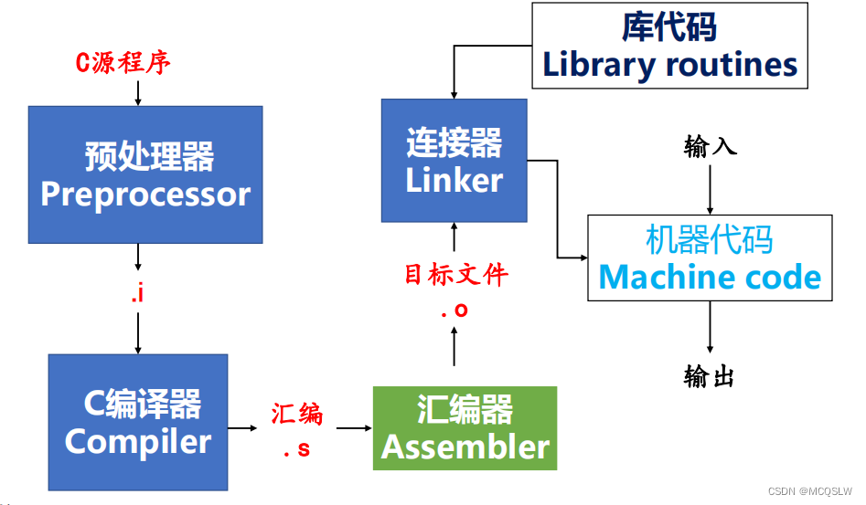

</div>

## 准备第一个程序

下面的程序就是经典的 `Hello World`，其运行效果是在终端输出 `Hello World`。

```c
#include <stdio.h>

int main()
{
    printf("Hello, world!\n");
    return 0;
}
```

可以用这段代码来检验环境是否成功配置。不过请注意：
+ 在本地，文件名应为 `hello.c`，后缀是 `.c`，不是 `.cpp` 或别的东西；
+ 代码中的括号、引号和分号都应使用英文符号（半角）；
+ 在本地，编译前先 `Ctrl+S` 保存文件；
+ 在本地，应该把代码放在**纯英文、没有空格的路径**中，能避开许多工具的路径兼容问题。

## 在线 IDE

在线 IDE 适用于非计算机专业同学。配好环境的同学也可以看一看，因为你可能偶尔临时用到一个没有配置环境的电脑，这时使用在线 IDE 最为便捷。当然，在线 IDE 功能有限，无法代替一个本地 IDE。

步骤如下：

+ 打开这个网址：<www.onlinegdb.com>。
+ 它已经为你写好 C 语言的 Hello World 程序源码。
+ 在右上角选择 C 语言，然后点击左上角的 Run。
+ 在下方，你就可以看见程序的输出。

<div align="center" markdown="1">

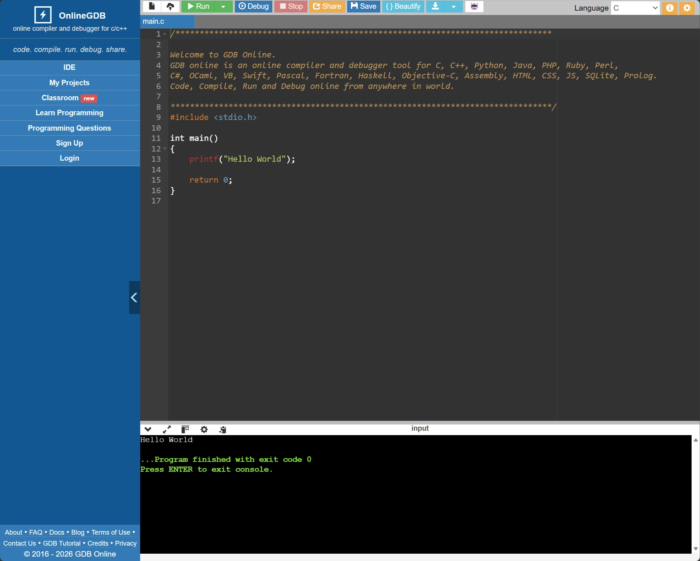

</div>

按下 ++enter++ 键离开终端。下方会显示几个选项：

- Command Line Arguments：命令行参数
- Standard Input：标准输入。你可以选择 Interactive Console（就是正常地用键盘和程序交互）或者 Text（预先准备一些文本自动输入，通常用于测试 PTA 的样例数据）。


## Dev-C++

Dev-C++ 是一个开箱即用的 IDE，适合希望先完成第一次编译运行的初学者（下载安装时请选择**包含 TDM-GCC 编译器**的版本，即 `Embarcadero_Dev-Cpp_6.3_TDM-GCC_9.2_Setup.exe`）。

- [Embarcadero Dev-C++](https://github.com/Embarcadero/Dev-Cpp)
- [Dev-C++ 6.3（SourceForge）](https://sourceforge.net/projects/embarcadero-devcpp/files/v6.3/)

安装完成后：

1. 打开 Dev-C++，选择 **文件（File）→ 新建（New）→ 源代码（Source File）**；
2. 写入上面的 Hello World 程序；
3. 按 `Ctrl+S`，将文件保存为 `hello.c`；——**注意保存时后缀名一定要选 `.c`**！
4. 选择 **运行（Execute）→ 编译并运行（Compile & Run）**；
5. 如果出现一个黑色窗口并显示 `Hello, world!`，就说明你配置完成了。

<div align="center" markdown="1">

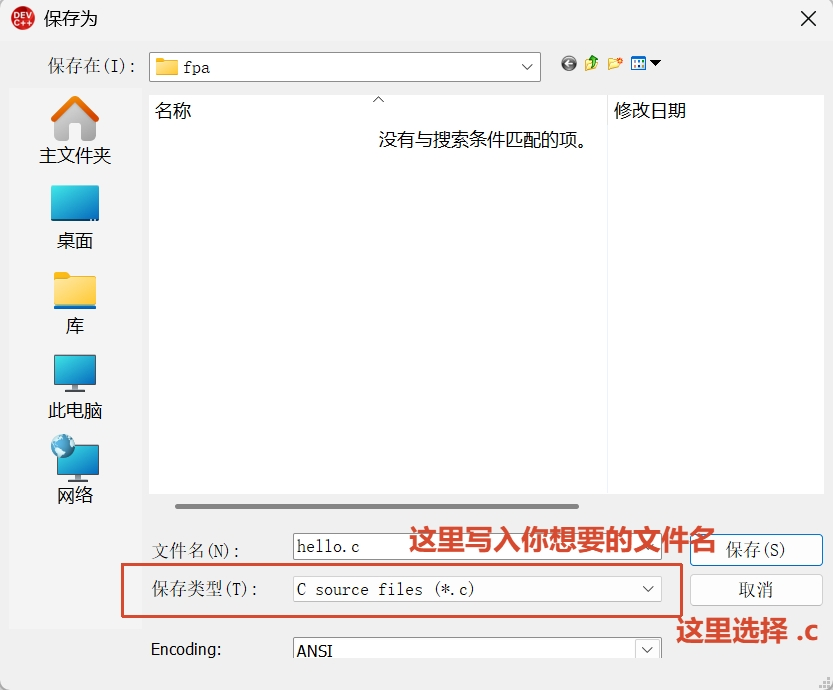

</div>
<div align="center" markdown="1">

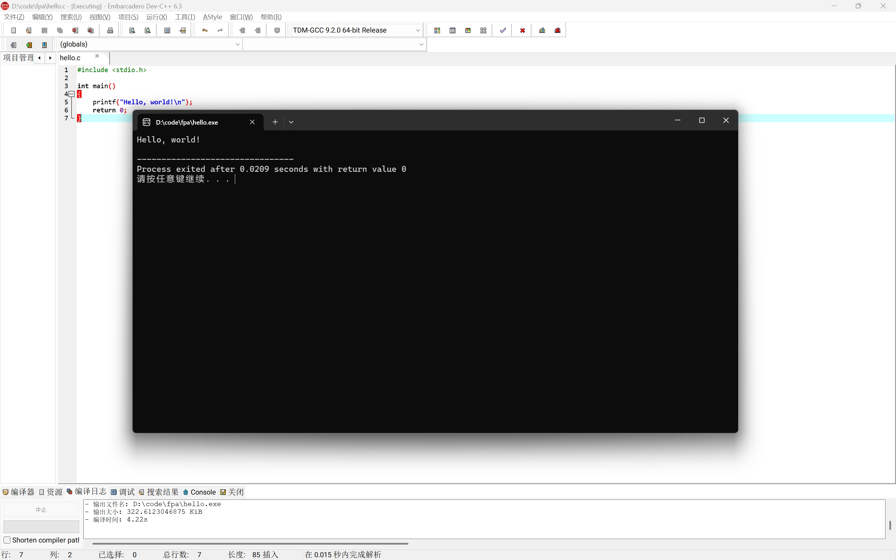

</div>

!!! note
    蓝色图标的（旧版）Dev-C++    由独立开发者 Orwelldevcpp 开发（现已停止），最新版本为5.11，使用GCC 4.9，上次更新时间为2015年4月。下载链接位于 <http://orwelldevcpp.blogspot.com/>。
    这个版本有些过于老旧，在现在可能会遇到各种问题。而 Embarcadero Dev-C++  是原版Dev-C++的继承和发展。
## Xcode

Xcode   是 Apple 提供的开发环境，可以从 [Mac App Store](https://apps.apple.com/app/xcode/id497799835) 安装。它的安装包较大，请预留下载和安装时间。

安装完成后：

1. 打开 Xcode，选择 **Create New Project**；
2. 选择 **macOS → Command Line Tool**；
3. `Product Name` 可以填写 `hello`，`Language` 选择 **C**；
4. 创建项目后，用上面的 Hello World 程序替换 `main.c` 中的内容；
5. 点击左上角的运行按钮，或按 `Command+R`；
6. 如果控制台中出现 `Hello, world!`，环境就可以使用了。


 Apple 官方关于创建 Xcode 项目的说明可以参考：<https://developer.apple.com/documentation/xcode/creating-an-xcode-project-for-an-app>

一个演示视频：<https://www.bilibili.com/video/BV11gs6zNEni/>

## VS Code：推荐的通用方案

VS Code 跨平台、插件丰富，今后的课程和项目中也能继续使用，因此比较推荐同学们尝试。但是它本身**只是编辑器**，因此需要再安装 **C/C++ 扩展和编译器**。

### 1. 安装 VS Code 和 C/C++ 扩展

从 [VS Code 官网](https://code.visualstudio.com/)  下载对应系统的安装包。Windows 安装程序中建议勾选“添加到 PATH”和“将 Code 注册为受支持的文件类型的编辑器”。

打开 VS Code，点击左侧“扩展”图标 ，搜索并安装 Microsoft 发布的 **C/C++** 扩展。这个扩展提供代码高亮、补全和调试支持，但它本身仍然不是编译器。

<div align="center" markdown="1">


</div>

如有需要，还可以安装 Microsoft 发布的界面汉化插件 **Chinese (Simplified) Language Pack**。

<div align="center" markdown="1">


</div>

安装汉化插件后可能需要你手动切换显示语言。Ctrl + Shift + P，出现的搜索框中输入 Configure，选择 Configure Display Language。

<div align="center" markdown="1">


</div>

随后再选择“中文 ( 简体 )”就可以完成界面汉化了。

<div align="center" markdown="1">


</div>

### 2. 安装编译器

#### Windows

在 Windows 平台上，我们可以使用 `MinGW-w64 GCC`。下面提供两种安装方法，**任选一种即可**，不要重复安装多套编译器。

=== "WinLibs"

    MinGW-w64 不只是一个编译器，而是一套完整的工具集合。简单来说，它提供了在 Windows 上使用 GCC 所需的编译器、链接器、库和头文件等工具。

    1. 从 [WinLibs](https://winlibs.com/) 或其 [GitHub 仓库](https://github.com/brechtsanders/winlibs_mingw/) 下载打包好的 GCC + MinGW-w64 工具链，`.zip` 或 `.7z` 压缩包均可。

        <div align="center" markdown="1">

        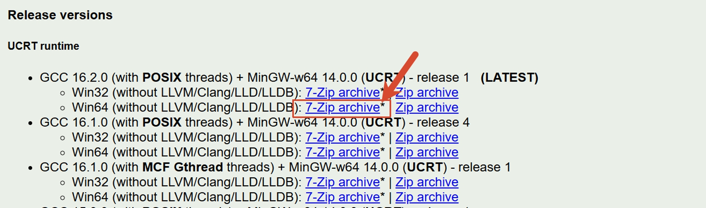

        </div>

        <div align="center" markdown="1">

        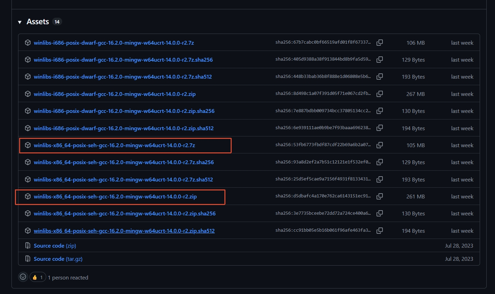

        </div>

    2. 解压到固定的**纯英文路径**，路径中不要有空格，例如 `C:\mingw64`。不要在使用期间随意移动它。
    3. 确认该目录下存在 `bin\gcc.exe`，然后把 `bin` 文件夹的完整路径（例如 `C:\mingw64\bin`）加入 Windows 的 `Path` 环境变量。
    4. **关闭并重新打开**终端和 VS Code，让新的环境变量生效。

    添加 `Path` 的方法：按 `Win+R`，输入 `sysdm.cpl` 并回车，依次打开“高级 → 环境变量”，在“用户变量”中的 `Path` 新增上述 `bin` 路径。不要删除 `Path` 中已有的其他项目。

=== "TDM-GCC"

    从 [TDM-GCC](https://jmeubank.github.io/tdm-gcc/download/) 选择 `tdm64-gcc-10.3.0-2.exe` 下载安装程序，然后选择 **Create**。

    <div style="text-align:center;">
        
    </div>

    选择 64 位系统：

    <div style="text-align:center;">
        
    </div>

    选择安装路径，推荐使用默认路径：

    <div style="text-align:center;">
        
    </div>

    安装选项中注意勾选 **Add to PATH**：

    <div style="text-align:center;">
        
    </div>

安装完成后，在一个新终端中执行：

```powershell
gcc --version
```

能看到 GCC 的版本信息即表示编译器可用。

<div align="center" markdown="1">

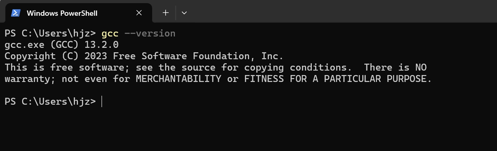

</div>

如果没有版本信息，可能是你还没有安装 gcc，或者你前一步 `Add to PATH` 没有正常进行，可能需要参照 [Windows 修改环境变量](#windows)进行环境变量的检查。

VS Code 官方还提供了 [使用 MinGW-w64 和 GCC 的教程](https://code.visualstudio.com/docs/cpp/config-mingw)。

#### macOS

macOS 可以直接使用 Apple 提供的 Clang 编译器。可见 [VS Code 官方教程](https://code.visualstudio.com/docs/cpp/config-clang-mac)。若已经安装 Xcode，一般无需重复安装命令行工具。

首先在“终端”中执行：

```bash
xcode-select --install
```

这条命令安装 Apple Command Line Tools，其次执行

```bash
clang --version
```
检查 Clang 是否安装完成。如果可以正常显示版本信息，即说明编译器可用。

### 3. VSCode 使用的一个简单示例

如下是 VS Code 的页面：

<div align="center" markdown="1">

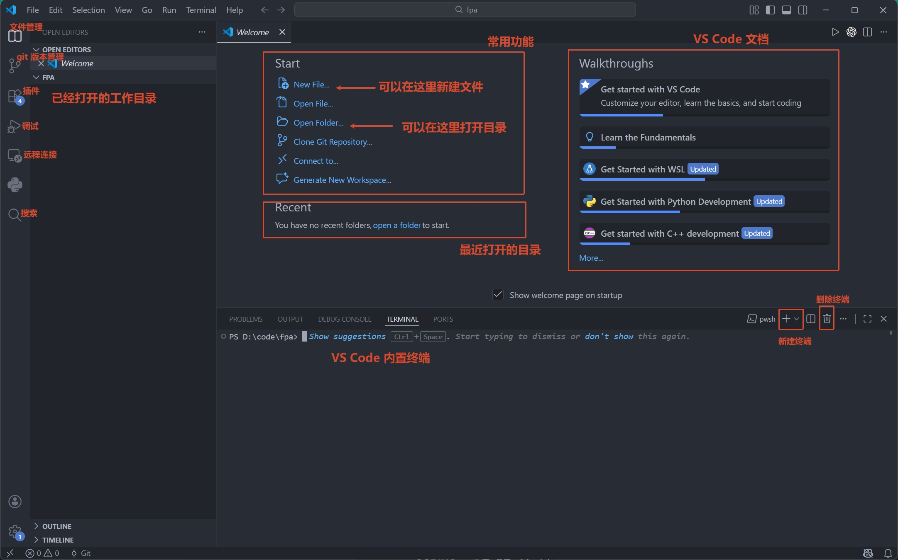

</div>

先创建一个专门存放代码的文件夹，例如 `D:\code\fpa`。然后打开 VS Code， VS Code 中选择 **File → Open Folder**，打开这个文件夹。


随后在左侧打开的工作目录区 右键 → New File 新建代码文件，输入文件名例如 `hello.c`，写入上面的 Hello World 程序并按 `Ctrl+S`（macOS 为 `Command+S`）保存。

!!! warning
    左侧标签如果仍显示 `Untitled-1`，或者文件名旁有表示未保存的圆点，说明代码还没有正确保存。终端无法编译一个只存在于编辑器、尚未保存的文件。

    一些同学写了代码后没有保存文件，文件名为 `Untitled-1` 或 `#include <stdio.h>`，如下图所示

    <div style="text-align:center;">
        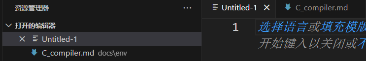
    </div>

    <div style="text-align:center;">
        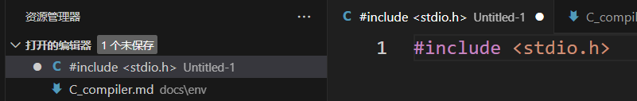
    </div>

    这些都属于没有保存的情况。

    文件命名请使用全英文，最好能表达这个代码文件的功能，并且加上 `.c` 的后缀名。


在 VS Code 顶部选择 **Terminal → New Terminal**。如果你按上一小节打开了文件夹，新终端通常已经位于 `hello.c` 所在目录。

=== "Windows（GCC）"

    编译：

    ```powershell
    gcc hello.c -o hello.exe
    ```

    运行：

    ```powershell
    .\hello.exe
    ```

=== "macOS（Clang）"

    编译：

    ```bash
    clang hello.c -o hello
    ```

    运行：

    ```bash
    ./hello
    ```


如果终端输出

```text
Hello, world!
```

就说明编辑器、编译器、工作目录和运行方式都已经配置正确。

<div align="center" markdown="1">

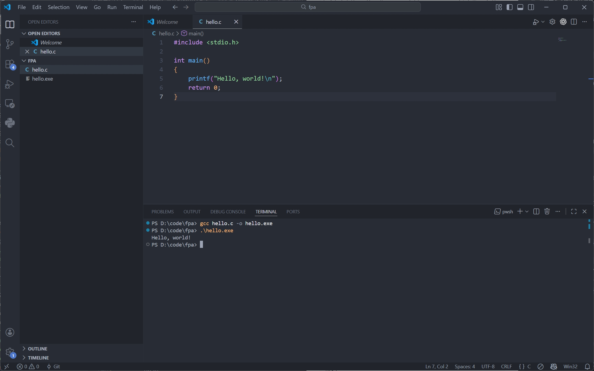

</div>

这里的 `-o` 用来指定输出文件名。如果省略它，GCC 通常会在 Windows 生成 `a.exe`，在 macOS  生成 `a.out`。

!!! note
    还应区分：

    - `gcc hello.c -o hello.exe` 是**编译**，成功时通常不会输出任何提示；
    - `.\hello.exe` 或 `./hello` 才是**运行**刚生成的程序。

## 常见问题

### 提示找不到 `gcc` 或 `clang`

- Windows 出现“无法将 `gcc` 识别为命令”或“不是内部或外部命令”，通常是编译器没有安装好，或编译器的 `bin` 目录没有正确加入 `Path`；
- 修改 `Path` 后必须关闭并重新打开终端和 VS Code；

这类错误发生在编译器启动之前，通常与 `hello.c` 中的代码无关。

### 提示找不到 `hello.c`

例如：

```text
fatal error: hello.c: No such file or directory
```

这表示终端当前所在目录中没有 `hello.c`。请检查：

1. 文件是否已经保存，扩展名是否确实为 `.c`；
2. VS Code 是否打开了包含该文件的文件夹；
3. 终端提示符显示的路径是否与左侧工作文件夹一致；
4. 在终端执行 `dir`（Windows）或 `ls`（macOS / Linux），能否看到 `hello.c`。


### 编译成功，却没有看到输出

编译和运行是两步。输入 `gcc hello.c -o hello.exe` 后没有报错，只代表已经生成程序；还要输入 `.\hello.exe` 才会运行。macOS / Linux 对应执行 `./hello`。

### 修改了代码，运行结果却没有变化

先保存源文件，再重新编译，最后重新运行。旧的可执行文件不会因为源代码发生变化而自动更新。

### 出现语法错误或链接错误

先定位输出中的第一条 `error`，并检查：

- `main`、`printf`、`#include <stdio.h>` 是否拼写正确；
- 英文分号 `;`、引号 `"` 和括号是否完整；
- 文件是否保存；
- 编译命令中的文件名是否与实际文件名完全一致；
- 当前工作目录、以及编译器安装路径是否是纯英文的，并且路径中不包含空格。

`ld returned 1 exit status` 或 `linker command failed` 往往只是最后的汇总信息，真正原因通常在它前面的报错中。
