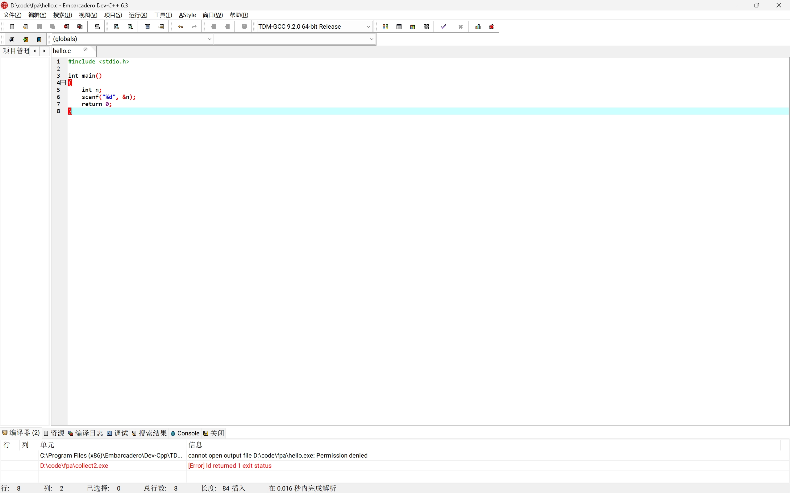
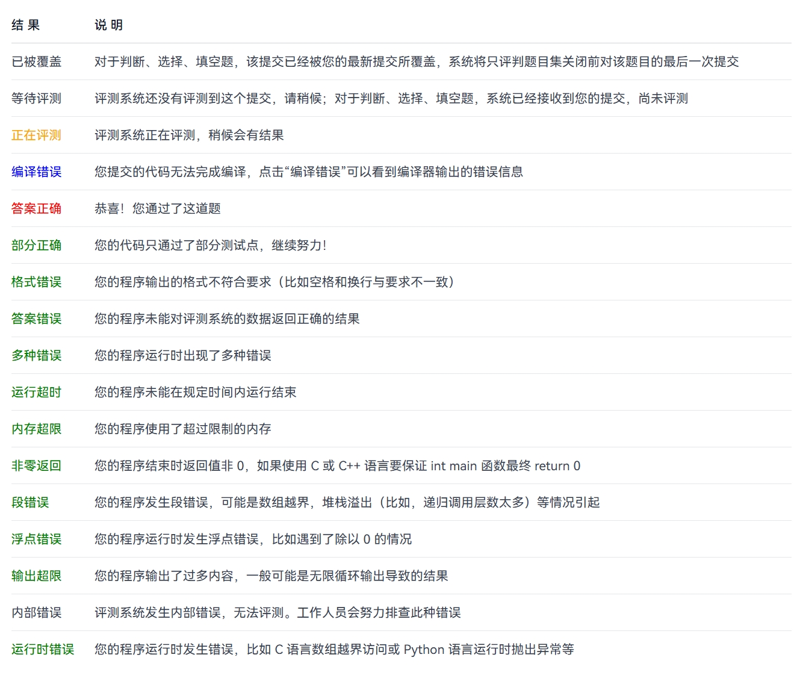
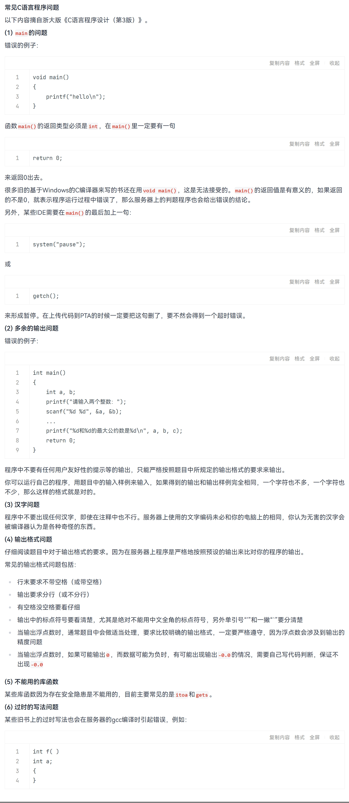

# FAQ (常见问题及回答)

!!! note
    在向他人提问之前，请注意：

    + 是否有尝试搜索相关的问题？
        —— 优先**积极搜索**，bing、google、[stackoverflow](https://stackoverflow.com/) 经常可以找到答案。
        （或许初学时百度百科、百度知道、CSDN 能够给你一些似乎还行的指引，但是随着你逐渐熟练，你会发现他们带给你的坑将远比帮助更多。）
    + [提问的智慧](https://github.com/ryanhanwu/How-To-Ask-Questions-The-Smart-Way/blob/main/README-zh_CN.md)
    + 【新生宝典】不要再拍屏了！新生大学习之如何正确地截图 https://www.cc98.org/topic/6265782 复制本链接到浏览器或者打开【CC98】微信小程序查看~

## 关于开发环境

+ 如何让代码跑起来？
+ 提示找不到 gcc 或 clang
+ 提示找不到 `hello.c`、`fatal error: hello.c: No such file or directory` 或者类似信息；

请见  [开发环境安装与第一次编译运行](env/index.md)。

## Dev-C++ 提示 ld.exe	cannot open output file XXX.exe: Permission denied

一种可能的原因是：检查一下是不是上一次程序没关，也就是受，你之前运行了一次程序，而没有以恰当的方式结束进程，导致控制台窗口仍然开着。关闭即可。

## 本地 Hello World 编译运行，出结果速度很慢

可能是 Windows Defender 或者其它的安全软件在扫描生成的可执行文件，将其关闭即可。

可见

+ [新电脑使用Dev-C++时进行编译运行，运行时出结果速度缓慢，要8秒左右，是什么原因啊？](https://www.zhihu.com/question/618314899)
+ [Windows11下由Windows Defender造成的C语言代码编译运行卡顿](https://michsong.com/posts/techtalk/windows11%E4%B8%8B%E7%94%B1windows-defender%E9%80%A0%E6%88%90%E7%9A%84c%E8%AF%AD%E8%A8%80%E4%BB%A3%E7%A0%81%E7%BC%96%E8%AF%91%E8%BF%90%E8%A1%8C%E5%8D%A1%E9%A1%BF/)

## 为什么教材里写的是 `main()` 而不是 `int main()`？

 Brian W. Kernighan 和 Dennis M. Ritchie（通常简称为K&R）的《C程序设计语言》这本书虽然是最著名和经典的 C 语言教材，但现在部分内容已经过时了。早期  C 语言刚出来时，确实可以直接写 `main()` 而不加前面的 `int`。但就现在的标准而言，由于`main`函数的返回值是整形，它前面那个 `int` 是必须的，不写的话编译器可能会报错。

 同理，某些资料还会出现 `void main()`，这是**错误的** 写法！可见 [C 语言中 int main() 和 void main() 有何区别？](https://www.zhihu.com/question/60047465)

## C++（Cpp） 和 C 有什么不同？

C++ 和 C 是**两种不同的编程语言**；在 C++ 设计之初，作者 Bjarne Stroustrup 希望兼容 C 语言，因而保留了 C 中几乎所有的内容。虽然某些 C 语言程序可以“当作 C++ 程序”来编译和运行，但是本质上， C++ 有比 C 更广泛的编程风格以及很多不同的功能，某些东西也在 C 和 C++ 中有不同的含义，所以并不能把 C 当作 C++ 的子集、或者 C++ 是 C 的扩展等等。

C# 是另一种语言，也不要和 C++ 或 C 搞混了。

可以参考这篇文章：[Understanding the Differences Between C#, C++, and C](https://csharp-station.com/understanding-the-differences-between-c-c-and-c/) by Janice Friedman 。

## 为什么报错 `expected ';' before ...`？

通常上一行末尾少了分号。编译器报错位置有时会偏后，要看它前面一行。

## 为什么我的程序在编译器能跑出来但是在 PTA 上就出问题？

因为“本地能跑”只说明它在你电脑的环境下、你试的那组输入下没崩。

例如，对某些实际上错误的写法（例如函数在声明之前调用），你电脑上的编译器可能会放你一马，但是 但 PTA 不会惯着你的程序。例如对未初始化的变量 `int a;`，你的编译器可能会默认把 a 初始化为 0，但 PTA 不一定。

此外，除了题目描述中的数据外，PTA 系统还会使用多组不同的、有挑战性的数据测试你提交的程序。请检查你的程序，确保它能正确地处理题目描述范围内的所有情况。

也可以使用 PTA 题目页面的“测试用例”功能，观察其输出是否和样例一致。

## 为什么 PTA 的测试点显示 运行超时/段错误/浮点错误/...？
它们的含义如下：

## 其它常见C语言程序问题

